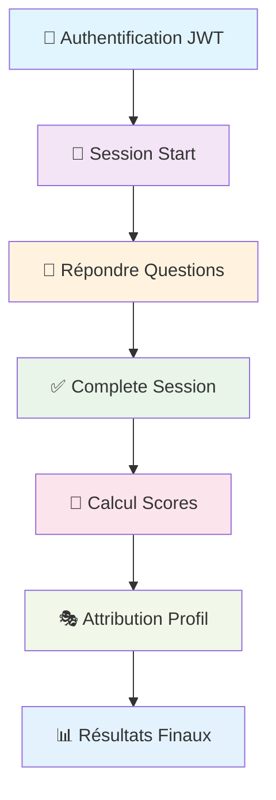
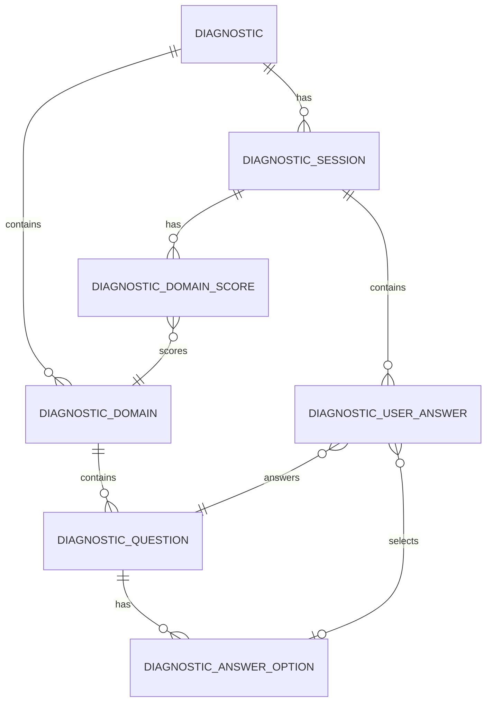

# 🎯 Module Diagnostic COLTIP

## 📋 Table des Matières

- [📋 Table des Matières](#-table-des-matières)
- [🌟 Vue d'ensemble](#-vue-densemble)
- [🏗️ Architecture](#️-architecture)
- [📊 Modèle de Données](#-modèle-de-données)
- [🌐 API Endpoints](#-api-endpoints)
- [🔧 Configuration et Installation](#-configuration-et-installation)
- [📝 Guide d'Utilisation](#-guide-dutilisation)
- [🧪 Tests et Validation](#-tests-et-validation)
- [🚀 Déploiement](#-déploiement)
- [📚 Documentation Technique](#-documentation-technique)
- [🔗 Références](#-références)

---

## 🌟 Vue d'ensemble

Le **Module Diagnostic COLTIP** est un système complet de gestion de diagnostics de personnalité professionnelle développé en **Spring Boot 3.4.2**. Il permet de créer, gérer et exécuter des tests psychométriques avec calcul automatique des scores et attribution de profils personnalisés.

### ✨ Fonctionnalités Principales

- 🎯 **Diagnostics Multi-domaines** : Support de domaines comme Communication, Leadership, etc.
- 📝 **Types de Questions Variés** : Single choice, multiple choice, échelles, texte libre
- 🧮 **Calcul Automatique des Scores** : Algorithmes de pondération et scoring
- 🎭 **Attribution de Profils** : Génération automatique de profils de personnalité
- 🔐 **Sécurité JWT** : Authentification et autorisation complètes
- 📊 **Sessions Trackées** : Gestion d'état et reprise de session
- ⚡ **Performance Optimisée** : Architecture modulaire et requêtes optimisées

---

## 🏗️ Architecture

### 📁 Structure du Module

```
coltip-backend-diagnostic/
├── 📦 config/                 # Configuration Spring
│   └── DiagnosticConfig.java
├── 🌐 controller/             # Contrôleurs REST
│   └── DiagnosticController.java
├── 📊 data/
│   ├── 📋 dto/               # Data Transfer Objects
│   │   ├── DiagnosticDTO.java
│   │   ├── DiagnosticSessionDTO.java
│   │   ├── DiagnosticResultDTO.java
│   │   └── ...
│   ├── 🗄️ entities/          # Entités JPA
│   │   ├── Diagnostic.java
│   │   ├── DiagnosticSession.java
│   │   ├── DiagnosticUserAnswer.java
│   │   └── ...
│   └── 🔍 repository/        # Repositories JPA
│       ├── DiagnosticRepository.java
│       ├── DiagnosticSessionRepository.java
│       └── ...
├── 🏷️ enums/                  # Énumérations
│   ├── QuestionType.java
│   └── SessionStatus.java
└── ⚙️ service/                # Services métier
    ├── DiagnosticService.java
    ├── DiagnosticCalculationService.java
    └── impl/
        ├── DiagnosticServiceImpl.java
        └── DiagnosticCalculationServiceImpl.java
```

### 🔄 Flux de Traitement



---

## 📊 Modèle de Données

### 🗄️ Entités Principales

#### 📋 Diagnostic
```java
@Entity
@Table(name = "diagnostic")
public class Diagnostic {
    @Id private Integer id;
    private String diagnosticName;
    private String description;
    private Boolean isActive;
    // Relations avec domaines et questions
}
```

#### 🎯 DiagnosticSession
```java
@Entity
@Table(name = "diagnostic_session")
public class DiagnosticSession {
    @Id private Integer id;
    private String sessionToken;        // UUID unique
    private SessionStatus status;       // IN_PROGRESS, COMPLETED, etc.
    private LocalDateTime startedAt;
    private LocalDateTime completedAt;
    private Double totalScore;
    private Integer userId;
    // Relations avec réponses et scores
}
```

#### 📝 DiagnosticUserAnswer
```java
@Entity
@Table(name = "diagnostic_user_answer")
public class DiagnosticUserAnswer {
    @Id private Integer id;
    private Integer numericAnswer;      // Pour échelles
    private String textAnswer;         // Pour texte libre
    private LocalDateTime answeredAt;
    // Relations avec session, question, option
}
```

#### 📊 DiagnosticDomainScore
```java
@Entity
@Table(name = "diagnostic_domain_score")  
public class DiagnosticDomainScore {
    @Id private Integer id;
    private Double rawScore;
    private Double weightedScore;
    private Double percentage;
    // Relations avec session et domaine
}
```

### 🔗 Relations entre Entités



---

## 🌐 API Endpoints

### 🎯 Gestion des Diagnostics

#### 📋 Lister tous les diagnostics actifs
```http
GET /api/diagnostic/diagnostics
```
**Réponse :**
```json
[
  {
    "id": 1,
    "diagnosticName": "Test de Personnalité Professionnelle",
    "description": "Évaluation complète...",
    "isActive": true
  }
]
```

#### 🔍 Détails d'un diagnostic
```http
GET /api/diagnostic/diagnostics/{diagnosticId}
```
**Réponse :**
```json
{
  "id": 1,
  "diagnosticName": "Test de Personnalité Professionnelle",
  "domains": [
    {
      "id": 1,
      "domainName": "Communication",
      "weight": 1.0,
      "questions": [...]
    }
  ]
}
```

### 🎯 Gestion des Sessions

#### 🚀 Démarrer une session
```http
POST /api/diagnostic/sessions/start
Content-Type: application/json

{
  "diagnosticId": 1,
  "userId": 1
}
```
**Réponse :**
```json
{
  "sessionToken": "59f634a4-2c34-4a31-b81f-795d5e48a00e",
  "status": "IN_PROGRESS",
  "startedAt": "2025-09-24T08:30:00.000Z",
  "diagnostic": {
    "id": 1,
    "diagnosticName": "Test de Personnalité Professionnelle"
  }
}
```

#### 📊 État d'une session
```http
GET /api/diagnostic/sessions/{sessionToken}
```

#### 📝 Soumettre une réponse
```http
POST /api/diagnostic/sessions/{sessionToken}/answers
Content-Type: application/json

// Pour SINGLE_CHOICE
{
  "questionId": 1,
  "selectedOptionId": 3
}

// Pour SCALE
{
  "questionId": 2,
  "answerText": "4"
}

// Pour MULTIPLE_CHOICE (répéter pour chaque option)
{
  "questionId": 3,
  "selectedOptionId": 5
}
```

#### ✅ Finaliser la session
```http
POST /api/diagnostic/sessions/{sessionToken}/complete
```
**Réponse :**
```json
{
  "sessionToken": "59f634a4-2c34-4a31-b81f-795d5e48a00e",
  "totalScore": 12.3,
  "percentageScore": 76.875,
  "domainScores": [
    {
      "domain": "Communication",
      "rawScore": 7.5,
      "weightedScore": 7.5,
      "percentageScore": 75.0
    }
  ],
  "resultProfile": {
    "profileName": "Communicateur Expert",
    "profileCode": "COMM_EXPERT",
    "recommendations": "Travaillez sur la prise de décision..."
  }
}
```

#### 📊 Récupérer les résultats
```http
GET /api/diagnostic/sessions/{sessionToken}/results
```

### 🛡️ Validation et Administration

#### ✅ Valider une session
```http
GET /api/diagnostic/sessions/{sessionToken}/validate
```
**Réponse :**
```json
{
  "isValid": true,
  "isComplete": false
}
```

#### 🧹 Nettoyage des sessions expirées (Admin)
```http
POST /api/diagnostic/admin/cleanup-expired
```

---

## 🔧 Configuration et Installation

### 📋 Prérequis

- ☕ **Java 17+**
- 🌸 **Spring Boot 3.4.2**
- 🐘 **PostgreSQL 17.2**
- 🔧 **Maven 3.8+**
- 🐳 **Docker** (optionnel)

### ⚙️ Configuration

#### 📝 application.properties
```properties
# Base de données
spring.datasource.url=jdbc:postgresql://localhost:5432/coltip_db
spring.datasource.username=coltip_user
spring.datasource.password=coltip_password

# JPA/Hibernate
spring.jpa.hibernate.ddl-auto=validate
spring.jpa.show-sql=false
spring.jpa.properties.hibernate.format_sql=true

# JWT Configuration
jwt.secret=your-secret-key
jwt.expiration=86400000

# Logging
logging.level.ca.coltip=DEBUG
```

#### 🐳 Docker Setup
```yaml
# docker-compose.yml
version: '3.8'
services:
  postgres:
    image: postgres:17.2
    environment:
      POSTGRES_DB: coltip_db
      POSTGRES_USER: coltip_user
      POSTGRES_PASSWORD: coltip_password
    ports:
      - "5432:5432"
```

### 🚀 Installation

#### 1️⃣ Cloner et compiler
```bash
# Cloner le projet
git clone <repository-url>
cd coltip-backend-diagnostic

# Compiler le module
mvn clean compile
```

#### 2️⃣ Lancer la base de données
```bash
# Avec Docker
docker-compose up -d postgres

# Ou installation locale PostgreSQL
```

#### 3️⃣ Configuration base de données
```sql
-- Créer la base et l'utilisateur
CREATE DATABASE coltip_db;
CREATE USER coltip_user WITH PASSWORD 'coltip_password';
GRANT ALL PRIVILEGES ON DATABASE coltip_db TO coltip_user;
```

#### 4️⃣ Exécuter les migrations
```bash
# Les scripts SQL sont dans /script/
psql -h localhost -U coltip_user -d coltip_db -f script/20250813_coltipdb_base_structure.sql
```

---

## 📝 Guide d'Utilisation

### 🎯 Workflow Complet

#### 1️⃣ Authentification
```http
POST /api/auth/signin
Content-Type: application/json

{
  "email": "user@example.com",
  "password": "password"
}
```

#### 2️⃣ Démarrer un diagnostic
```http
POST /api/diagnostic/sessions/start
Authorization: Bearer <jwt-token>
Content-Type: application/json

{
  "diagnosticId": 1,
  "userId": 1
}
```

#### 3️⃣ Répondre aux questions
Pour chaque question, utiliser le format approprié selon le type :

**SINGLE_CHOICE :**
```json
{
  "questionId": 1,
  "selectedOptionId": 3
}
```

**SCALE (1-5) :**
```json
{
  "questionId": 2,
  "answerText": "4"
}
```

**MULTIPLE_CHOICE :**
```json
// Répéter pour chaque option sélectionnée
{
  "questionId": 3,
  "selectedOptionId": 5
}
{
  "questionId": 3,
  "selectedOptionId": 7
}
```

#### 4️⃣ Finaliser et récupérer les résultats
```http
POST /api/diagnostic/sessions/{token}/complete
GET /api/diagnostic/sessions/{token}/results
```

### 📊 Types de Questions

| Type | Description | Format Réponse |
|------|-------------|----------------|
| `SINGLE_CHOICE` | Une seule option | `selectedOptionId` |
| `MULTIPLE_CHOICE` | Plusieurs options | `selectedOptionId` (multiple) |
| `SCALE` | Échelle 1-5 | `answerText` |
| `TEXT_INPUT` | Texte libre | `answerText` |

### 🎭 Système de Profils

Les profils sont attribués automatiquement selon les scores totaux :

- **🌟 Expert Communicateur** : 10-15 points
- **👥 Leader Naturel** : 15-20 points  
- **🚀 Manager Complet** : 20+ points

---

## 🧪 Tests et Validation

### ✅ Tests Unitaires
```bash
# Exécuter les tests
mvn test

# Tests spécifiques au module diagnostic
mvn test -Dtest="ca.coltip.diagnostic.*"
```

### 🧪 Tests d'Intégration
Voir le fichier [TEST_API_DIAGNOSTIC.md](TEST_API_DIAGNOSTIC.md) pour le guide complet de tests avec Postman.

### 📊 Tests de Performance
- ⚡ **Session Start** : < 200ms
- 📝 **Submit Answer** : < 100ms  
- 🧮 **Calculate Results** : < 500ms
- 📊 **Get Results** : < 150ms

---

## 🚀 Déploiement

### 🐳 Docker
```dockerfile
FROM openjdk:17-jdk-slim
COPY target/coltip.jar app.jar
EXPOSE 8080
ENTRYPOINT ["java", "-jar", "/app.jar"]
```

### ☁️ Production
```bash
# Build pour production
mvn clean package -Pprod

# Variables d'environnement
export SPRING_PROFILES_ACTIVE=prod
export DATABASE_URL=jdbc:postgresql://prod-db:5432/coltip_db
export JWT_SECRET=production-secret-key
```

---

## 📚 Documentation Technique

### 🔧 Services Principaux

#### DiagnosticService
- **Responsabilité** : Gestion des sessions et coordonnées générales
- **Méthodes clés** :
  - `startDiagnosticSession()` : Création de nouvelle session
  - `saveAnswer()` : Enregistrement des réponses
  - `completeSession()` : Finalisation et déclenchement du calcul

#### DiagnosticCalculationService  
- **Responsabilité** : Calculs de scores et attribution de profils
- **Algorithme** :
  1. Calcul des scores bruts par domaine
  2. Application des pondérations
  3. Calcul des pourcentages
  4. Attribution du profil selon les fourchettes

### 🛠️ Optimisations Techniques

#### 🚫 Résolution MultipleBagFetchException
```java
// ❌ Problématique
@Query("SELECT s FROM DiagnosticSession s 
        LEFT JOIN FETCH s.userAnswers 
        LEFT JOIN FETCH s.domainScores 
        WHERE s.sessionToken = :token")

// ✅ Solution
@Query("SELECT DISTINCT s FROM DiagnosticSession s 
        LEFT JOIN FETCH s.domainScores 
        WHERE s.sessionToken = :token")
Optional<DiagnosticSession> findBySessionTokenWithScores(String token);

@Query("SELECT DISTINCT s FROM DiagnosticSession s 
        LEFT JOIN FETCH s.userAnswers 
        WHERE s.sessionToken = :token")  
Optional<DiagnosticSession> findBySessionTokenWithAnswers(String token);
```

#### 🔄 Gestion des Transactions
```java
// ❌ Read-only bloque les INSERT
@Transactional(readOnly = true)

// ✅ Transaction complète
@Transactional
public DiagnosticResultDTO getSessionResult(String sessionToken) {
    // Permet INSERT des scores calculés
}
```

### 📊 Monitoring et Logs

```java
// Logging configuré par classe
private static final Logger logger = LoggerFactory.getLogger(DiagnosticController.class);

// Exemple de log structuré
logger.info("Request to start session for user {} and diagnostic {}", userId, diagnosticId);
logger.error("Error completing session: {}", sessionToken, e);
```

---

## 🔗 Références

### 📖 Documentation
- [Spring Boot Documentation](https://spring.io/projects/spring-boot)
- [Spring Data JPA](https://spring.io/projects/spring-data-jpa)
- [PostgreSQL Documentation](https://www.postgresql.org/docs/)

### 🛠️ Outils
- **Postman** : Test des APIs
- **pgAdmin** : Administration PostgreSQL
- **Docker Desktop** : Conteneurisation

### 📋 Standards
- **REST API** : Suivre les conventions RESTful
- **JSON** : Format d'échange de données
- **JWT** : Authentification sécurisée
- **JPA** : Mapping objet-relationnel

---

## 👥 Équipe de Développement

- **Développeur Principal** : [Nom]
- **Architecture** : [Nom]
- **Tests & QA** : [Nom]

---

## 📄 Licence

Ce projet est sous licence [Type de Licence] - voir le fichier [LICENSE.md](LICENSE.md) pour plus de détails.

---

**🎯 Module Diagnostic COLTIP** - *Version 1.0.0*  
*Dernière mise à jour : Septembre 2025*

---

> 💡 **Note** : Cette documentation est maintenue à jour avec chaque version. Pour toute question technique, consultez les logs ou contactez l'équipe de développement.